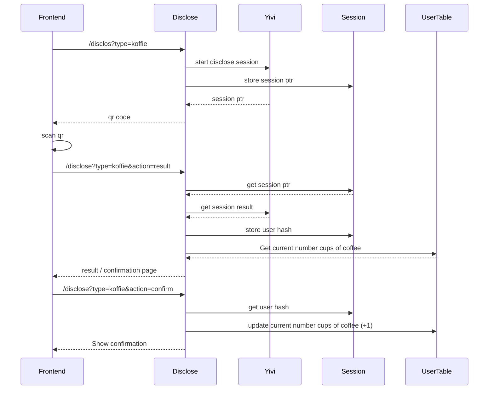

# To do for demo
- [x] Kiezen voor ~~AD groep~~ of voor email
- [x] Demo schema PR mergen https://github.com/privacybydesign/irma-demo-schememanager/pull/126
- [x] Disclosure age testen
- [x] Disclosure employee testen
- [x] Disclosure koffie counter implementeren
- [x] Disclosure koffie testen

# To do for live
- [x] Account aanmaken incl. vpc, monitoring, dns
- [x] Configuratie object aanmaken in project
- [ ] Mergen naar main
- [ ] Deploy pipeline naar gn-build
- [ ] Schema PR mergen https://github.com/privacybydesign/pbdf-schememanager/pull/125
- [ ] Configureren SSM parameters:
  - [ ] Private key
  - [ ] url van api gateway voor webapp
  - [ ] Afhanklijke van ADgroup/email -> UUID van AD group
- [ ] Configureren in code:
  - [ ] OIDC client secret ARN in configuratie object OIDC profiel
  - [ ] OIDC client ID in configuratie object OIDC profiel
- [ ] Toevoegen CNAME record certificaat yivi-voor-medewerkers.nijmegen.nl
- [ ] Toevoegen CNAME record yivi-voor-medewerkers.nijmegen.nl

## Koffie halen flow
